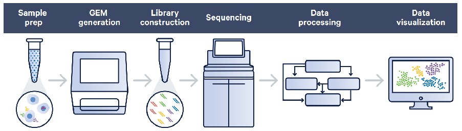
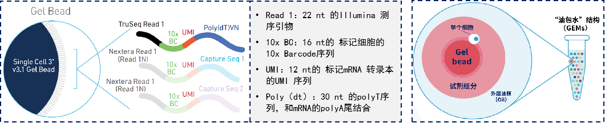
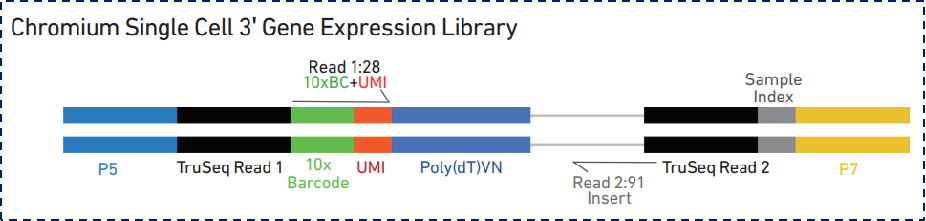
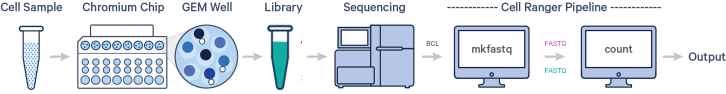
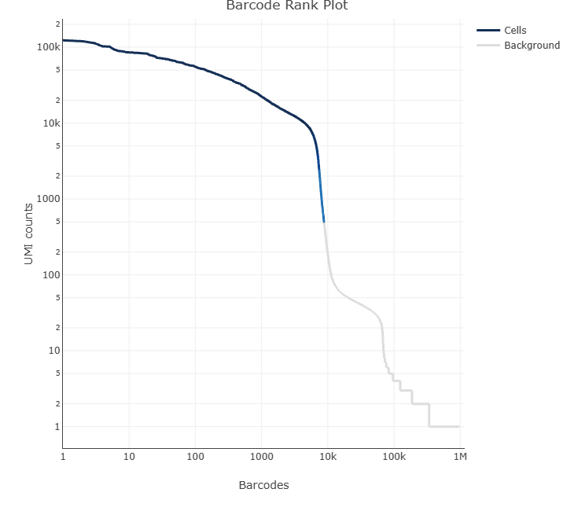
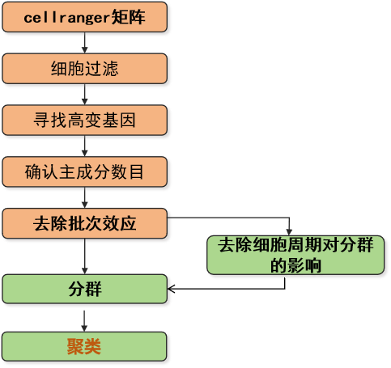
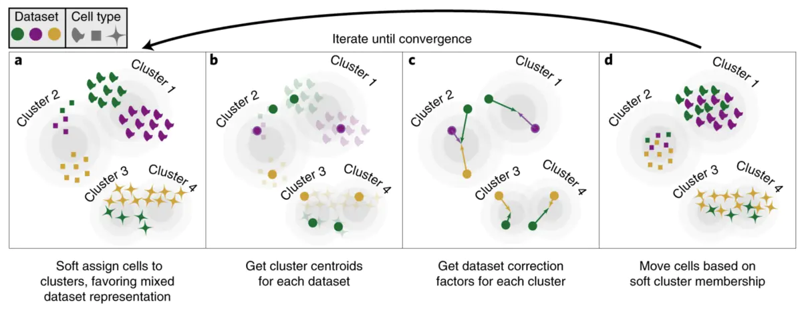

# 10x单细胞RNA-Seq分析报告

## 项目整体流程概况

### 项目背景信息

&[项目信息](./table/project.txt)

### 项目流程介绍

#### 实验流程

<b>图1:实验流程示意图</b>

  
根据组织或细胞样品的来源和特性，选取的方法将其制备成单细胞（或单细胞核）悬液并进行质控，使用合格的细胞悬液（或核悬液）样本在10x Genomics的仪器中，将单个细胞、反应所需试剂、带有细胞标签序列（Cell Barcode）的凝胶珠（Gel bead）一起包裹在油滴中，形成GEMs；在GEM油滴中，细胞裂解释放出mRNA，mRNA的polyA尾会与胶珠上的Poly( dT)引物结合，进行互补延伸，完成逆转录。随后GEMs会被打破，回收cDNA，通过PCR扩增富集并构建文库。文库质检合格后，利用Illumina测序平台对文库进行测序，测序模式为PE150。
  

<b>图2：Gel bead结构示意图（图左）和“油包水”结构示意图（图右）</b>

  

<b>图 3:最终文库结构示意图</b>

  

#### 分析流程

  测序数据下机后，我们会对数据进行分析，分析流程概述如下：

<ul>

<li type="none">（1）使用10x Genomics官方分析软件Cell Ranger对测序原始reads进行统计、质控、与参考基因组比对、细胞判定和基因表达定量分析。（Cell Ranger下载：<a href=https://support.10xgenomics.com/single-cell-gene-expression/software/overview/welcome" target="_blank">https://support.10xgenomics.com/single-cell-gene-expression/software/overview/welcome</a>）。
</li>

<li type="none">（2）多样本联合分析：使用Seurat软件进行数据过滤，并基于样本基因表达量对细胞进行降维分群聚类并计算cluster高表达基因和组间差异表达基因。</li>

<li type="none">（3）高级分析和个性化分析：此部分为额外分析内容，如有需要可联系对应销售同事。</li>

</ul>

生信分析流程图如下：

<b>图4：生信分析流程示意图</b>

  

### CellRanger分析结果

#### CellRanger分析流程介绍
根据组织或细胞样品的来源和特性，选择合适的方法将样本制备成单细胞（或单细胞核）悬液并进行质控，随后进行单细胞上机实验。单个细胞、反应所需试剂、带有细胞标签序列（Cell Barcode）的凝胶珠（Gel bead）会在仪器中形成“油包水（GEMs）”结构；在GEMs油滴中，细胞裂解释放出mRNA，mRNA的polyA尾会与胶珠上的Poly( dT)引物结合，将每个细胞的所有mRNA都加上Cell Barcode序列并在油滴中完成反转录。随后“破油”，对cDNA产物富集并构建文库。文库质检合格后，利用Illumina测序平台对文库进行测序，测序模式为PE150。
  

<b>图 5:单细胞测序完整工作流程示意图</b>

  

以下结果是Cell Ranger软件质控结果展示，详细输出结果见结果目录：文件夹[02_cellranger](./02_cellranger/)；

#### 测序Reads统计与质控

&[表 1 测序数据统计](./table/table1.txt)

<ul>
	<b>【注】:</b>
	<ul>
		<li type="none">Number of Reads：每个样本测序得到的总reads数</li>
		<li type="none">Valid Barcodes：校正后与白名单匹配的Barcode数量占比，即为有效Barcodes</li>
		<li type="none">Sequencing Saturation：测序饱和度。在总的reads之中，有部分reads仅被检测到了1次。测序饱和度指至少被检测到2次的reads占比</li>
		<li type="none">Q30 Bases in UMIs：UMIs中测序质量值大于等于 30 的碱基百分比（质量值（Q）越高代表碱基被测错的概率（P）越小，质量值是30，则错误识别的概率是0.1%，即错误率0.1%，或者正确率是99.9%）</li>
		<li type="none">Q30 Bases in Reads：Reads中测序质量值大于等于 30 的碱基百分比</li>
		<li type="none">Q30 Bases in Barcodes：Barcodes中测序质量值大于等于 30 的碱基百分比</li>
	</ul>
</ul>

#### 参考基因组比对结果

&[表 2 比对信息统计表](./table/table3.txt)

<ul>
	<b>【注】：</b>
	<ul>
		<li type="none">Mapped Confidently to Genome:   比对到基因组的比例</li>
		<li type="none">Mapped Confidently to Intergenic Regions:   比对到基因间区的比例</li>
		<li type="none">Mapped Confidently to Intronic Regions: 比对到内含子的比例</li>
		<li type="none">Mapped Confidently to Exonic Regions:   比对到外显子的比例</li>
        <li type="none">Mapped Confidently to Transcriptom:比对到基因区的比例</li>
		<li type="none">Mapped Antisense to Gene:   比对到基因反义链的比例</li>
	</ul>
</ul>

#### 细胞判定与基因表达定量

单细胞数据中，通常认为一个Barcode就是一个细胞。但由于细胞活性、杂质/碎片等原因，会有一些液滴是空细胞。因此，Cell Ranger 采用两步法来识别细胞。第一步，把所有大于某一阈值的 Barcodes 识别为细胞。这一步保证了高 RNA 含量的 Barcodes 被保留。第二步，把剩余未通过阈值的 Barcodes 与空细胞 RNA 表达谱进行比较来回收可能的低 RNA 含量细胞[1]。

&[表 3 测序reads质控与统计](./table/table2.txt)

<ul>
	<b>【注】：</b>
	<ul>
		<li type="none">Estimated Number of Cells ：Cell Ranger软件经算法预测得到的细胞数</li>
		<li type="none">Mean Reads per Cell ：各个细胞检测到的reads数的平均数(即测序总reads/细胞数)</li>
		<li type="none">Median Genes per Cell ：有效细胞中的基因表达数目中位数(各个细胞检测到的基因数按从高到低排列后的中位数)</li>
		<li type="none">Fraction Reads in Cells ：归属到有效细胞中的reads占总reads的比例</li>
		<li type="none">Median UMI Counts per Cell ：有效细胞中的UMI数目中位数各个细胞检测到的UMI数按从高到低排列后的中位数</li>
		<li type="none">Total Genes Detected ：所有细胞检测到的基因总数</li>
	</ul>
</ul>

<b>【注】：</b>
此图为示意图，具体图片请参考Cellranger报告。图中横坐标为Barcode序列数，纵坐标为UMI 数目。蓝线对应的Barcode为有效细胞，灰线为背景噪音。

  

### 多样本整合聚类分群结果

#### 多样本整合聚类分群流程介绍

数据完成Cell ranger质控后，下一步是多样本数据整合，在整合之前，需要对数据进行过滤。单细胞实验中，理想状态是每一个微液滴（droplet）都只含有单一的活细胞。然而，由于技术条件的限制，实验过程中也会存在一个微液滴未捕获到任何细胞，即空液滴（empty droplet）；捕获到死细胞；同时捕获到两个或多个细胞，即双细胞液滴（doublet）或多细胞液滴（multiplet）等。因此，在多样本数据整合之前需要对数据进行过滤，去除这些异常细胞。除此之外有些基因只在个别细胞中检测到，我们也会对检出的不可信基因进行过滤。
Seurat[2]是一个基于R分析单细胞数据的软件包，我们使用Seurat 软件对数据进行过滤，基于样本基因表达量对细胞进行降维聚类分群、t-SNE/UMAP可视化，并计算cluster高表达基因。
以下是多样本整合聚类分群结果展示，详细输出结果见结果目录：[04_Clustering](./04_Clustering)

<b>图 7: 分析流程示意图</b>

#### 数据过滤

本项目使用细胞过滤指标为：
	<ul>
		<li type="disc">过滤掉总的基因数大于7000或者小于400的细胞（过高的基因数可能为双细胞或多细胞，过少的基因数可能是空液滴）；</li>
		<li type="disc">过滤掉总的UMI数大于50000的细胞；</li>
		<li type="disc">过滤掉线粒体基因表达占比大于20%的细胞（除了一些特殊的代谢旺盛的组织类型，凋亡中的细胞通常线粒体基因表达异常高，线粒体基因表达量可以作为鉴定样本中低质量细胞的参照指标）；</li>
	</ul>

本项目使用基因过滤指标为：
	<ul>
		<li type="disc">过滤掉只在小于等于3个细胞中表达的基因；</li>
	</ul>

过滤前后每个细胞的基因数量（nFeature_RNA）、UMI 数量（nCount_RNA）、线粒体基因所占比例（percent.mito）的结果展示如下：

<ul>
	<b>【注】:</b>
	<ul>
		<li type="none">小提琴图中每个点表示一个细胞，第一行：过滤前各个样本细胞基本信息的分布；第二行：过滤后各个样本细胞基本信息的分布。</li>
		<li type="none">nFeature_RNA图：过滤前后各个样本单个细胞中检测到的基因数量分布情况；</li>
		<li type="none">nCount_RNA图：过滤前后各个样本单个细胞中检测到的UMI分布情况；</li>
		<li type="none">percent.mt图：过滤前后各个样本单个细胞中线粒体基因表达量的百分比分布情况。</li>
	</ul>
</ul>

&[表 4 细胞过滤统计表](./table/cells_filter_stat.txt)

<ul>
	<b>【注】：</b>
	<ul>
		<li type="none">cell_num_raw：样本过滤前的细胞数；</li>
		<li type="none">cell_num-filter：样本过滤后剩下的细胞数；</li>
		<li type="none">percent：过滤后剩余细胞数占过滤前细胞数的比值；</li>
	</ul>
</ul>

#### 降维聚类分群

在数据过滤完成之后，我们接下来需要对数据进行整合降维、去批次、消除细胞周期影响、聚类分群，并通过t-SNE或UMAP进行可视化展示。

<b>（1）数据归一化: </b>使用“SCTransform”函数对数据进行归一化，目的是消除不同样本间文库大小，测序深度等差异，使样本间具有可比性；

<b>（2）降维: </b>

<b>为何要降维：</b>单细胞测序数据中含有成千上万个细胞，每个细胞中又有数千数万个基因，而每个细胞、基因都是一个维度，这就使单细胞数据成为一个高维复杂的数据。单细胞分析的一个重点就是用尽可能少的维度来展示数据真实的结构。但这么多维度我们无法处理，所以需要尽可能保证真实差异的前提下减少维度的数量，因此需要挑出那些更能代表不同细胞类型的基因。

<b>如何做降维？</b>

<ul>
<li type="none"><b>a.</b>&nbsp挑选高变基因 ：在处理单细胞数据时需要选择能代表整体差异的基因进行降维，即高可变基因(highly variable genes，HVGs)，一般情况下选择前2000个高变基因进行后续降维分析。</li>
</ul>

<ul>
	<b>【注】：</b>
	<ul>
		<li type="none">图中每个点表示一个细胞。图中每个点代表一个特定的基因，默认红色点表示该样本前2000个高可变基因，灰色点为非高可变基因。</li>
		<li type="none">横坐标：每个样本的高度可变基因</li>
		<li type="none">纵坐标：标准方差值</li>
	</ul>
</ul>

<ul>
    <li type="none"><b>b.</b>&nbspPCA分析 ：PCA（Principal Component Analysis）降维是一种无监督的方式，常用在数据的降维也就是数据预处理方面，经过PCA后，可以生成一个“肘形图”(Elbow Plot)，通常会建议降维的维度选大于拐点（肘部）的值（选择PC20, PC30, PC50进行下游分析结果通常不会有太大的差异）。我们默认选择PC50进行后续分析。</li>
</ul>

<b>（3） 整合去批次</b>

单细胞数据往往跨多个批次生成数据，而不同批次的处理可能会存在系统差异。本次分析采用Harmony单细胞测序数据整合算法进行单细胞多样本不同批次数据的整合。

生信分析流程图如下：

<b>图 11：Harmony去批次原理说明图</b>

<b>（4）消除细胞周期影响</b>

进行单细胞分析时，不同类型的细胞可能受细胞周期基因的表达影响而聚类在一起，相同类型的细胞在聚类时会因为细胞周期基因的表达不同而分开，因此有必要进行细胞周期分析，降低细胞周期基因表达对细胞分群的影响。

<b>【注】：</b>图中每个点表示一个细胞。不同颜色代表不同细胞处于不同的细胞周期阶段。当三种颜色均匀分布在各个群中时说明细胞周期相关基因基本不影响聚类分群。

<ul>
	<b>【注】：</b>
	<ul>
    	<li type="none">横坐标：不同样本</li>
		<li type="none">纵坐标：不同细胞周期阶段占比</li>
	</ul>
</ul>

#### 细胞聚类分群

基于Leiden聚类算法对细胞进行聚类和分群。一般而言，相似的细胞具有相似的基因表达谱，因此可以根据每个细胞的基因表达情况，将表达谱相似的细胞聚类到一起，形成一个细胞群。最后将降维后的数据通过t-SNE与UMAP进行可视化展示。需要注意的是，可以根据不同的研究目的来选用不同的可视化结果，例如t-SNE的方法通常对不同亚群细胞的分类结果有更佳的呈现效果（亚群间的隔离更加清晰），而UMAP得到的结果中细胞群间的距离相对更接近细胞之间实际的关系。

以下以umap图结果为例来展示细胞分群结果：

<b>图14：nFeature,nCount,percent.mt映射UMAP图</b>

<ul>
	<b>【注】：</b>
	<ul>
		<li type="none">nFeature_RNA：每个细胞表达的基因数分布图；</li>
		<li type="none">nCount_RNA：每个细胞表达的UMI数分布图；</li>
		<li type="none">percent.mt：线粒体基因表达占比分布图；</li>
	</ul>
</ul>

<b>图15：整体按照分组和亚群的划分的UMAP图</b>

<ul>
	<b>【注】：</b>每个点代表一个细胞。
	<ul>
		<li type="none">图左：不同颜色代表不同样本细胞的umap分布图；</li>
		<li type="none">图右：不同颜色代表不同cluster的umap分布图；</li>
	</ul>
</ul>

&[表 5 各样本中不同cluster细胞数目统计表](./table/cluster_summary.txt)

<ul>
	<b>【注】：</b>表格中统计了不同样本中不同cluster所含的细胞数目。
	<ul>
		<li type="none">Sample：样本名称；</li>
		<li type="none">数字编号：0，1，2···等数字分别对应cluster编号；</li>
	</ul>
</ul>

<b>图16：按照分组和亚群展示细胞类型占比差异柱状图</b>

<ul>
	<b>【注】：</b>
	<ul>
		<li type="none">图左：不同分组中各个cluster占比堆叠柱状图，横坐标是不同分组，颜色代表不同cluster；</li>
		<li type="none">图右：不同样本中各个cluster占比堆叠柱状图，横坐标是不同样本，颜色代表不同cluster；</li>
	</ul>
</ul>

### Marker基因鉴定
基于降维聚类得到的结果，我们使用非参数检验方法（wilcox秩和检验），寻找在每个cluster中特异性高表达的基因，这些基因即为marker基因。此处需注意，与来源于文献的，可直接用来做细胞注释的经典marker基因不同，这里的marker基因是通过算法筛选出来的，可以与经典marker一起辅助我们判断该cluster具体所属细胞类型。对这些算法发现的marker基因做功能富集分析，可以帮助我们判断该cluster行使的生物学功能，对未知细胞亚群进行功能注释。
<ul>
<li type="none">marker基因筛选参数为：</li>
<ul>
<li type="disc">表达倍数绝对值|avg_log2FC| >0.25;</li>
<li type="disc">P值<0.05；</li>
</ul>
</ul>

以下是marker基因鉴定和注释的结果，以多种形式进行展示，详细输出结果见结果目录：[05_Marker](./05_Marker)

<b>【注】：</b>不同颜色代表不同cluster，每个柱形上的数字代表该cluster经算法发现的marker基因数目。

&[表 6 all markers基因注释表](./table/marker_anno.txt)

<ul>
	<b>【注】：</b>
	<ul>
	<li type="none">Pvalue：显著性p值；</li>
	<li type="none">avg_log2FC：差异倍数的log2值；</li>
	<li type="none">pct.1：基因在cluster(i) 中有表达的细胞比例；</li>
	<li type="none">pct.2：基因在除了cluster(i)中以外所有的cluster中有表达的细胞比例；</li>
	<li type="none">p_val_adj：校正后的p值；</li>
	<li type="none">Cluster Name：marker基因所属的cluster；</li>
	</ul>
</ul>

<b>【注】：</b>
黄色表示高表达，红色表示低表达，顶部注释条表示cluster名，纵坐标是各个cluster的top10 marker基因。由于cluster之间的top10的差异基因间可能存在重复，因此实际基因数目可能偏小。

  

<b>图 19：各cluster marker基因（top5）气泡图</b>

<b>【注】：</b>横坐标是每个细胞群的top5 marker基因，纵坐标是cluster。颜色从红到蓝表示该基因平均表达值从高到低。点越大，该基因在该cluster中的表达比例越大。

  

<select class="form-select form-select-sm mb-3 img-select" option-type="image">
{{top10_gene_umap}}
</select>

<b>图20：各cluste Top10 marker基因小提琴图</b>

<b>【注】：</b>每一个小图表示对应基因在各个细胞中的表达情况，颜色越深表示表达值越高。可选择查看不同cluster的top10 marker表达图。

  

<select class="form-select form-select-sm mb-3 img-select" option-type="image">
{{top10_gene_violin}}
</select>

<b>图21：各cluste Top10 marker基因小提琴图</b>

<b>【注】：</b>
横坐标为细胞群编号，纵坐标为标准化后的基因表达值，每个小提琴图表示该marker基因在对应cluster中所有细胞的表达分布情况。可选择查看不同cluster的top10 marker表达小提琴图。

### 基因功能富集分析
#### 基因功能富集分析介绍
通过对各个细胞类型差异上调基因（即上面分析得到的marker基因）进行富集分析，可以找到该细胞类型特异性高表达的基因与哪些生物学功能或通路显著性相关。使用clusterProfiler[3]软件对基因集进行GO功能富集分析，KEGG通路富集分析。
以下是功能富集分析结果展示，详细输出结果见结果目录：[04_enrichment](./04_enrichment)
#### GO功能富集分析
GO(Gene Ontology)是描述基因功能的综合性数据库，可分为分子功能（Molecular Function），生物过程（biological process）和细胞组成（cellular component）三个部分。我们统计富集到相应GO term 上的基因数目，然后通过超几何分布方法计算P-value（显著富集的标准为P-value < 0.05），找出与整个背景基因集合相比，差异基因显著富集的GO term ，从而确定细胞群行使的主要生物学功能。
&[表7 GO富集分析统计表](./table/GO_enrichment.txt)

<ul>
	<b>【注】：</b>
	<ul>
		<li type="none">GO_function：GO ontology 的功能分类；</li>
		<li type="none">GO_ID：富集到的GO Term的ID；</li>
		<li type="none">GO_Term：富集到的GO Term名称；</li>
		<li type="none">List：样本数据中富集到该GO Term的marker基因数目；</li>
		<li type="none">Total：基因组中注释到该GO Term的基因数目；</li>
		<li type="none">Pvalue：富集显著性P值；</li>
		<li type="none">p_val_adj：校正后的p值；</li>
		<li type="none">Gene_symbol：样本数据中富集到该GO Term的marker基因名称；</li>
	</ul>
</ul>

对差异表达的基因的GO富集分析结果，按照分子功能MF、生物过程BP 和细胞组分CC 进行GO 分类，挑选p-value最小即富集最显著的前10个GO term条目进行柱状图展示，结果如下：

<select class="form-select form-select-sm mb-3 img-select" option-type="image">
{{go_bar}}
</select>

<b>图 22：GO富集分析柱状图</b>

<b>【注】：</b>
横坐标为Go term，纵坐标为每个term富集的-log10(p-value)。不同颜色是不同GO_function。

根据GO富集结果，通过Rich factor、p_val_adj值和富集到此GO Term 上的基因个数来衡量富集的程度。采用ggplot2选取前10个绘制气泡图展示，结果如下：

<select class="form-select form-select-sm mb-3 img-select" option-type="image">
{{go_dot}}
</select>

<b>图 23：GO富集分析气泡图</b>

<b>【注】：</b>
横坐标为具体的GO term；纵坐标为Rich factor，Rich factor 指该GO Term 中富集到的差异基因个数与注释到的基因个数的比值。Rich factor越大，表示富集的程度越大；图中圆点的大小表示富集到该term的差异基因的个数，颜色表示该通路的p_val_adj值。图中展示的是结果里最显著的10个GO term。

#### KEGG功能富集分析
KEGG（Kyoto Encyclopedia of Genes and Genomes）[4]是系统分析基因功能、基因组信息数据的库，它有助于研究者把基因及表达信息作为一个整体网络进行研究。我们统计各个KEGG Pathway不同层级上包含的差异表达基因数目，然后通过超几何分布方法计算P-value（显著富集的标准为P-value < 0.05），找出与整个背景基因集合相比，差异基因显著富集的KEGG pathway ，从而确定marker基因主要参与的代谢途径和信号通路。
&[表8 KEGG富集分析统计表](./table/KEGG_enrichment.txt)

<ul>
	<b>【注】：</b>
	<ul>
		<li type="none">Pathway_ID：富集到的KEGG Pathway的ID；</li>
		<li type="none">KEGG_Pathway：富集到的KEGG Pathway名称；</li>
		<li type="none">Level1：KEGG Pathway所属的1级通路，包含7个分支：代谢（Metabolism），遗传信息处理（Genetic Information Processing），环境信息处理（Environmental Information Processing），细胞过程（Cellular Processes），生物体系统（Organismal Systems），人类疾病（Human Diseases），药物开发（Drug Development）；</li>
		<li type="none">Level2：KEGG Pathway所属的2级通路；</li>
		<li type="none">List：样本数据中富集到该KEGG Pathway的marker基因数目；</li>
		<li type="none">Total：基因组中注释到该KEGG Pathway的基因数目；</li>
		<li type="none">P-value：富集显著性P值；</li>
		<li type="none">p_val_adj：校正后的p值；</li>
		<li type="none">Gene_symbol：样本数据中富集到该KEGG Pathway的marker基因名称；</li>
</ul>

</ul>

根据marker基因的KEGG富集分析结果，挑选p_val_adj最小即富集最显著的前10个 Pathway 进行柱状图展示，结果如下：

<select class="form-select form-select-sm mb-3 img-select" option-type="image">
{{kegg_bar}}
</select>

<b>图 24：KEGG富集分析柱状图</b>

<b>【注】：</b>
横坐标为KEGG pathway，纵坐标为每个pathway富集的-log10(p-value)。不同颜色是不同KEGG Level1的分支

根据KEGG富集结果，通过Rich factor、p_val_adj值和富集到此KEGG pathway上的基因个数来衡量富集的程度。采用ggplot2选取前10个绘制气泡图展示，结果如下：

<select class="form-select form-select-sm mb-3 img-select" option-type="image">
{{kegg_dot}}
</select>

<b>图25：KEGG富集分析气泡图</b>

<b>【注】：</b>
横坐标为具体的KEGG pathway；纵坐标为Rich factor，Rich factor 指该KEGG pathway 中富集到的差异基因个数与注释到的基因个数的比值。Rich factor越大，表示富集的程度越大；图中圆点的大小表示富集到该pathway的差异基因的个数，颜色表示该通路的p_val_adj值。图中展示的是结果里最显著的10pathway

### 数据挖掘思路

<table style="width: 800px">

<tr>
<td><a href="https://mp.weixin.qq.com/s/-go6dIp2Y-OnjZEPvf76Ag" target="_blank">单细胞热门思路方向荟萃——肠道篇</a></td>

<td><a href="https://mp.weixin.qq.com/s/5PrWqOJFsezr_kpKn9eheg" target="_blank">单细胞热门思路方向集锦——眼科篇</a></td>
</tr>

<tr>
<td><a href="https://mp.weixin.qq.com/s/Xky7tymu5SCrrPTIEWQnfA" target="_blank">单细胞热门思路方向荟萃 | 牙周炎篇</a></td>

<td><a href="https://mp.weixin.qq.com/s/INhcqSfYURVeYEgwHX2cng" target="_blank">强强联合：类器官+单细胞转录组测序（一）</a></td>
</tr>

<tr>
<td><a href="https://mp.weixin.qq.com/s/bPHPPuTYs8nEN7W4S6cgiw" target="_blank">强强联合：类器官+单细胞转录组测序（二）</a></td>

<td><a href="https://mp.weixin.qq.com/s/P2HMbAHCIWL0YssfKqEtQg" target="_blank">单细胞测序在水产研究中的应用</a></td>
</tr>

<tr>
<td><a href="https://mp.weixin.qq.com/s/_o-FziuTMHzTdaFMyrGYyQ" target="_blank">单细胞转录组和常规组学联合应用思路大全</a></td>

<td><a href="https://mp.weixin.qq.com/s/FTb9VuEuj4HtXJ-5WWAG6w" target="_blank">空间转录组的应用领域和研究思路</a></td>
</tr>

<tr>
<td><a href="https://mp.weixin.qq.com/s/YLwH1HyE_hJLL9oMF6o9Xw" target="_blank">【单细胞农学专题上】单细胞测序在植物研究中的应用</a></td>

<td><a href="https://mp.weixin.qq.com/s/U5w1YtDwQF1us3G8FGYveg" target="_blank">【单细胞农学专题下】单细胞测序在农学动物研究中的应用</a></td>
</tr>

<tr>
<td><a href="https://mp.weixin.qq.com/s/LctYMA_32ewug6Wdyzye9Q" target="_blank">单细胞测序在药物研发中的应用</a></td>

<td><a href="https://mp.weixin.qq.com/s/YhiQqsjXtJqDHmUTbCJkWw" target="_blank">单细胞空转“显卡”加速器——Xenium技术应用解析</a></td>
</tr>

<tr>
<td><a href="https://mp.weixin.qq.com/s/FHdgr_vrVy8ilOnqhBMWiw" target="_blank">单细胞测序技术在植物方向的应用</a></td>

<td><a href="https://mp.weixin.qq.com/s/qUZpjnJfvc7vuTLZKM22Tw" target="_blank">单细胞高级分析之拟时轨迹分析应用思路解读</a></td>
</tr>

<tr>
<td><a href="https://mp.weixin.qq.com/s/5A3lZ-DO-clMFg6tYayRzA" target="_blank">smRNAᴾˢᴺ-Seq | 微生物单细胞转录组测序全栈解析</a></td>

<td><a href="https://mp.weixin.qq.com/s/H_rwwcT8NoQKmouMUMr5gw" target="_blank">外泌体单细胞测序技术</a></td>
</tr>

</table>

### 附录和参考文献

#### 10x单细胞常见问题

<button type="button" class="collapsible">样本捕获细胞数与预期不符怎么办？</button>

  Estimated Number of Cells即为每个样本捕获到的细胞数目，值得注意的是，如果这里分析得到的细胞数与预期有上下波动是很正常的。由于每个样本的细胞状态都不一样，比如细胞活性、细胞碎片/杂质含量、细胞大小/形状均一度、是否包含表达量较低的细胞等，最终捕获到的实际细胞数可能会与预期捕获到的细胞数存在差异。此时可以在后续数据挖掘时可以根据具体情况进行人工调整，比如使用Cell ranger自带的参数--force-cells进行尝试调整，或者后续进一步对细胞进行过滤。

<button type="button" class="collapsible">中位基因数指标代表什么含义？</button>

  Median Genes per Cell即为基因中位数，指将每个细胞检测到的基因数从高到低排列得到的中位数。在测序量足够时，这个指标通常反映了细胞的整体质量，如果细胞存在明显的死亡、应激等情况，基因中位数会有显著的下降。并且基因中位数和样本的细胞类型有很大关系，例如成熟B细胞、T细胞含有的中位基因数较少，而肿瘤组织、干细胞等组织，基因表达数较高，含有的中位基因数也较高。

<button type="button" class="collapsible">什么是测序饱和度？</button>

  Sequencing Saturation即测序的饱和度，指至少被检测到2次的reads占比，受测序深度和文库复杂度（细胞质量、细胞异质性、细胞数目、RNA含量等）的影响。测序饱和度目前没有具体的标准范围。对于常规的单细胞测序研究目的来说，由于我们关注的主要是细胞聚类和高表达的功能基因，并不要求饱和度达到很高的水平，即可完成高质量的细胞分群和后续分析。如果试图鉴定各细胞中低表达的转录本，则需要更高的测序饱和度。提高测序饱和度只需要对文库继续加测数据即可。

<button type="button" class="collapsible">哪些组织样本或细胞建议提核做单细胞核测序？</button>

1.冷冻组织，细胞膜稳定性较差，冻存后细胞膜被破坏，难以通过酶解法获得高质量的单细胞悬液，核膜稳定性较高，可以抽核做单细胞核。
2.关注组织中某类特定的细胞类型，如关注脑组织中的神经元细胞，心脏组织中的心肌细胞，建议提核。
3.植物样本，不同植物组织之间原生质体解离方案差异很大，且有些植物细胞比较大，超过40μm，此外很多植物细胞具有多种细胞器及各种次生代谢物影响实验结果，选择抽核可以很好的解决。

<button type="button" class="collapsible">单细胞测序和空间转录组测序是否需要生物学重复？</button>

1.单细胞测序：建议做生物学重复，单细胞测序技术作为近几年新兴的技术，早期由于技术成本高昂，部分研究会选择不做生物学重复，获得细胞图谱信息。但是随着此项技术的普及和研究的深入，研究者从单细胞水平不局限于只获得细胞图谱，组间比较成为研究重点，审稿也对样本有生物学重复要求。
建议临床样本至少5个生物学重复，其它样本至少3个生物学重复，具体重复数量根据老师经费决定 。 
2.空间转录组测序：可以不做生物学重复。原因如下：空间转录组在实际实验操作上很难实现生物学重复。由于组织空间内部结构具有一定异质性，要求每个样本切片时的方位与深度等都一致，才能得到对应的生物学重复切片。对于高度复杂的组织块，即使是连续切片，它们之间的可变程度也很高，重复之间的效果不好。

<button type="button" class="collapsible">单细胞转录组数据细胞类型注释的方法有哪些？</button>

1. 基于已知细胞类型标签的细胞样本作为参考数据集，通过软件工具进行自动化注释（如SingleR），注释效率高，但准确度有限。
2. 基于参考数据库、文献资料确定已知细胞类型的特征表达基因（marker基因）进行人工注释，是目前大家认可的细胞注释的金标准，此过程需要专业的经验且花费大量的时间精力，且具有一定的主观性。
3.结合自动化注释和人工注释，在自动化注释的前提下，再经过专业的人工注释校正，可大大提高注释的准确度和效率。

<button type="button" class="collapsible">注释细胞类型的 marker 基因怎么获得？</button>

1.细胞注释数据库。如人鼠数据库CellMarker，植物数据库PlantCellMarker，多物种（人，鼠，猴，斑马鱼，水稻等34个物种）数据库Cell Taxonomy等；
2.文献梳理。数据库中的信息更新相对较慢，还可以收集最新发表的单细胞文献中的细胞marker；
3.亚群上调表达基因推测。有些细胞的亚群没有公认的marker基因，需要根据亚群差异基因列表中高表达基因进行推测；
4.近缘物种的同源基因。对于研究相对较少的物种，可以参考近缘物种的注释maker。

#### 10x单细胞实验方法说明文档

<table style="width: 800px">

<tr>

<td><a href="https://mp.weixin.qq.com/s?search_click_id=17124245324437369059-1716797235243-4374759132&__biz=MzIyNTAxNTc1MQ==&mid=2652185937&idx=1&sn=2bb1f8294a01b30bbf99affc81b78361&chksm=f3e7a7f9c4902eef9108c0d280e5aca8f689147516710b860a0e56ce19b2de17f74c7371f173&scene=7&subscene=10000&clicktime=1716797235&enterid=1716797235&sessionid=0&ascene=65&fasttmpl_type=0&fasttmpl_fullversion=7224675-zh_CN-zip&fasttmpl_flag=0&realreporttime=1716797235266&devicetype=android-30&version=4.1.26.6014&nettype=WIFI&abtest_cookie=AAACAA%3D%3D&lang=zh_CN&countrycode=CN&exportkey=n_ChQIAhIQTbvxxWoPKQIhz0wUSMxQ3xLZAQIE97dBBAEAAAAAADH8LTTq95QAAAAOpnltbLcz9gKNyK89dVj0CcfhWxcymLwd1AB4yIFZ504H9xlK52k5ken%2FWbE6Q2Bj%2F0cUJQBRre4sgcHfkciH%2FuAxDu%2FLwqGNppjSAe0SKxK6a2qX5N3%2FSDcUwXADlzePEMzOYf6%2BKisBnkuIjoABtoqXNLpiXBhNFsfsm5CUyUVm0XQE91KstDbAbv3W6tYgbzSEL%2FZxAxnc%2BXWsOM7H%2F8vQSDV6we7SaoTUOOQptJzDdmJwfA9FD6vg5q2DAssLOuY%3D&pass_ticket=JxI0qfptVB%2FJ%2B8HeKHmNJdAFp%2BYJTADsuHLB09ruhOordQTdy9fOXCLnaXKlfiXx&wx_header=3&from=industrynews&platform=win&nwr_flag=1#wechat_redirect" target="_blank">谈谈单细胞测序的细胞数目</a></td>

<td><a href="https://mp.weixin.qq.com/s?search_click_id=17124245324437369059-1716797331180-2183349613&__biz=MzIyNTAxNTc1MQ==&mid=2652187042&idx=1&sn=88f75e37c3e448e8ceb7839ee3093b78&chksm=f3e7ab0ac490221c2c2dd9ebb2107d17f3715a9a0a020f14b7be72eb1931b35f439921ebdec1&scene=7&subscene=10000&clicktime=1716797331&enterid=1716797331&sessionid=0&ascene=65&fasttmpl_type=0&fasttmpl_fullversion=7224675-zh_CN-zip&fasttmpl_flag=0&realreporttime=1716797331206&devicetype=android-30&version=4.1.26.6014&nettype=WIFI&abtest_cookie=AAACAA%3D%3D&lang=zh_CN&countrycode=CN&exportkey=n_ChQIAhIQZKB4G3Kc7Cwu4n8hzK5uCRLZAQIE97dBBAEAAAAAADy1De40GOsAAAAOpnltbLcz9gKNyK89dVj0IehS9IYmuVb54j9zEFVlrhDrJBno7ZQr4R4eS5q61CWRrcrl4KGaNOtAHGdpfJh2UjF1TU4QAF0JoEuD5xaWvRv568RC21lsV0dsO7CFzp3QVj3eaM4KaUUbQKgIs4juQJQW1engGLELl%2FGJn5J6ZnD4oKwe1VI3IlfD1xVVVBvbnhZYVekruoi5RUk1h3AedCFXzROBspyPKCR3dwcRo1eP%2FdsGGcIFIVnb862geCAeFg4%3D&pass_ticket=ziUGRYpffekcY%2BF8305jdamxlNDBeUC9SDJ%2Fy3RfwohPt4GQ9NaS52mHGBd2biop&wx_header=3&from=industrynews&platform=win&nwr_flag=1#wechat_redirect" target="_blank">10X单细胞悬液——小鼠胰腺</a></td>

</tr>

<tr>

<td><a href="https://mp.weixin.qq.com/s?search_click_id=17124245324437369059-1716797235243-4374759132&__biz=MzIyNTAxNTc1MQ==&mid=2652185937&idx=1&sn=2bb1f8294a01b30bbf99affc81b78361&chksm=f3e7a7f9c4902eef9108c0d280e5aca8f689147516710b860a0e56ce19b2de17f74c7371f173&scene=7&subscene=10000&clicktime=1716797235&enterid=1716797235&sessionid=0&ascene=65&fasttmpl_type=0&fasttmpl_fullversion=7224675-zh_CN-zip&fasttmpl_flag=0&realreporttime=1716797235266&devicetype=android-30&version=4.1.26.6014&nettype=WIFI&abtest_cookie=AAACAA%3D%3D&lang=zh_CN&countrycode=CN&exportkey=n_ChQIAhIQTbvxxWoPKQIhz0wUSMxQ3xLZAQIE97dBBAEAAAAAADH8LTTq95QAAAAOpnltbLcz9gKNyK89dVj0CcfhWxcymLwd1AB4yIFZ504H9xlK52k5ken%2FWbE6Q2Bj%2F0cUJQBRre4sgcHfkciH%2FuAxDu%2FLwqGNppjSAe0SKxK6a2qX5N3%2FSDcUwXADlzePEMzOYf6%2BKisBnkuIjoABtoqXNLpiXBhNFsfsm5CUyUVm0XQE91KstDbAbv3W6tYgbzSEL%2FZxAxnc%2BXWsOM7H%2F8vQSDV6we7SaoTUOOQptJzDdmJwfA9FD6vg5q2DAssLOuY%3D&pass_ticket=JxI0qfptVB%2FJ%2B8HeKHmNJdAFp%2BYJTADsuHLB09ruhOordQTdy9fOXCLnaXKlfiXx&wx_header=3&from=industrynews&platform=win&nwr_flag=1#wechat_redirect" target="_blank">单细胞测序or单细胞核测序如何选择</a></td>

<td><a href="https://mp.weixin.qq.com/s?search_click_id=17124245324437369059-1716797419798-5584852584&__biz=MzIyNTAxNTc1MQ==&mid=2652192211&idx=1&sn=1a03b926f007276cbf47f3f270277e72&chksm=f3e7bf7bc490366d06bc095e0bbf0cff5fdc9e0383ece67d6618274d9f0f0f83a82e9053c407&scene=7&subscene=10000&clicktime=1716797419&enterid=1716797419&sessionid=0&ascene=65&fasttmpl_type=0&fasttmpl_fullversion=7224675-zh_CN-zip&fasttmpl_flag=0&realreporttime=1716797419824&devicetype=android-30&version=4.1.26.6014&nettype=WIFI&abtest_cookie=AAACAA%3D%3D&lang=zh_CN&countrycode=CN&exportkey=n_ChQIAhIQuytJ67RxjcJZeNZ7y%2BrZKRLZAQIE97dBBAEAAAAAAJkkDizHk4EAAAAOpnltbLcz9gKNyK89dVj0sFKenf0ULo9WGt0ceoBrEaF1BAGHDj7JPFWJGrIBP55TYhSFMEK60hFSlPO4FCHA8M2zUkFcKe8IeACZzdqm7S3F46p9Qk4%2Fe1Coo5rOXKVuUo2HJaJSNHdmUYoX619Ie%2BohV4iKD%2F85BOQj2w8TFAzxroiznCBo4iGGv3Fe1WMHkRIynQO%2FNWessXDPTwyLEDtT0eOgI8tbYQl%2BU%2BNTSDTUgtbv5FPIX17TRr5M5655RjA%3D&pass_ticket=DkPhfuQorEW5Bub07%2Bcv2KMcTHVF2L3L4Zt677bGmyc8hZtNE5AbR60FeudZHyKT&wx_header=3&from=industrynews&platform=win&nwr_flag=1#wechat_redirect" target="_blank">单细胞测序悬浮液制备专题——皮肤组织</a></td>

</tr>
<tr>

<td><a href="https://mp.weixin.qq.com/s?search_click_id=17124245324437369059-1716797472457-0639853890&__biz=MzIyNTAxNTc1MQ==&mid=2652195853&idx=1&sn=7201a401a0c6da9fcac9376baf11dfed&chksm=f3e7cea5c49047b32e2c2f70850d1e3c4208095b614f5bc97e44515c61b5c54089fadab082e2&scene=7&subscene=10000&clicktime=1716797472&enterid=1716797472&sessionid=0&ascene=65&fasttmpl_type=0&fasttmpl_fullversion=7224675-zh_CN-zip&fasttmpl_flag=0&realreporttime=1716797472491&devicetype=android-30&version=4.1.26.6014&nettype=WIFI&abtest_cookie=AAACAA%3D%3D&lang=zh_CN&countrycode=CN&exportkey=n_ChQIAhIQn0SpmSJYZjD38t0rgdyPQRLZAQIE97dBBAEAAAAAAMwiCTSnqkAAAAAOpnltbLcz9gKNyK89dVj07dWa5AvNZZ0qCnEPMlMEa5MivV8wdPEE6ASTWpnE6ZSelL8FctyAU0ZlxvngSqyi26GtHkAq4lOSW2DAoJ0kiwP2Mco9hbzXEsrq7yAolFgxEzOGnFhEWzFf%2F42QcMNq6Kfbyz92z899jBNe9BT4DrxTOMUMrxaEfOod5E3FGd1vcnRvjE8P74%2FDf7pV9KJRnHad8hVeS5jRXyhBBelGxpSae0bjA9IWE%2BIn7HuCcOxmKFw%3D&pass_ticket=WL6xOosKRHQcGh4gSZoQUgdl9Fd%2BlCq6VVfTSv53Atk6LZb2CBOmqZnXSh9u8ptm&wx_header=3&from=industrynews&platform=win&nwr_flag=1#wechat_redirect" target="_blank">单细胞测序样本送样指南
</a></td>

<td><a href="https://mp.weixin.qq.com/s?search_click_id=17124245324437369059-1716797525038-3420285561&__biz=MzIyNTAxNTc1MQ==&mid=2652196024&idx=1&sn=d27baf66296373d4f825e08023d2a30b&chksm=f3e7ce10c49047065d2791b694c949454ae1a5e8decb5444969023fdc83daa209a7db94d3406&scene=7&subscene=10000&clicktime=1716797525&enterid=1716797525&sessionid=0&ascene=65&fasttmpl_type=0&fasttmpl_fullversion=7224675-zh_CN-zip&fasttmpl_flag=0&realreporttime=1716797525061&devicetype=android-30&version=4.1.26.6014&nettype=WIFI&abtest_cookie=AAACAA%3D%3D&lang=zh_CN&countrycode=CN&exportkey=n_ChQIAhIQfwM0%2BtXiUKYl9PazgJcOlRLZAQIE97dBBAEAAAAAACxFIXge9MEAAAAOpnltbLcz9gKNyK89dVj00Vddwg0HQKo%2FWxgPy1hdpQxYAvfrNAbB66S1pevS7C5h9gzIouE1gzoOPMzmYSiBH0iTNTgy8oTvruaiYJ6ctkQB75l2BLIS%2BHT5LsjSW9UKAIuNkiWrfsdhcKqb1sGQgn1xfijb0QJXGlRus6mvvoIk8LIacunpbf2p36LGwmnd%2FIw5y5h9Sg6laTcxzSPzBvqJaVchmr%2B50fxvnU9b0jabKm76rhYJJXQBFrZedniUnx0%3D&pass_ticket=Y2L7m4dZgM20c54vi%2BhDuYgxySVFjr7xJZUnHs2wmgYIKmyZp8MDjHKsybMYxz88&wx_header=3&from=industrynews&platform=win&nwr_flag=1#wechat_redirect" target="_blank">单细胞项目悬浮液制备宝典
</a></td>

</tr>

<tr>
<td><a href="https://mp.weixin.qq.com/s?search_click_id=17124245324437369059-1716797559844-4467430964&__biz=MzIyNTAxNTc1MQ==&mid=2652196532&idx=1&sn=cd9834205219099539a888b05e7ed312&chksm=f3e7cc1cc490450a1548fd560ba5171a990ccb712b5e8083f5f881d77ea535abf8492f60cb3e&scene=7&subscene=10000&clicktime=1716797559&enterid=1716797559&sessionid=0&ascene=65&fasttmpl_type=0&fasttmpl_fullversion=7224675-zh_CN-zip&fasttmpl_flag=0&realreporttime=1716797559872&devicetype=android-30&version=4.1.26.6016&nettype=WIFI&abtest_cookie=AAACAA%3D%3D&lang=zh_CN&countrycode=CN&exportkey=n_ChQIAhIQLXjMjqUVHSSgRGZD25%2BEvxLZAQIE97dBBAEAAAAAACeZIwWwauAAAAAOpnltbLcz9gKNyK89dVj0cZG%2Ba4n1pTSqvDWObhxcfYYlyV22ryWSF7F4w069Wkh%2F2zoAq56BiEizAmNf5GCAeR8Wo665makm0tqi5%2BDytCglzafpf0fKgjE3fbcY0q6cVrKdadrwFVBpjMhwqvtTfGkwvnB34E37QUrjk4KUpK95eD8n7MH7yqaZyKh0vLZsutIK9ptnWPDcxEXMQE%2BE6LkHtn21AqSxf3V%2Fd2VeNcx7PlVZcDPn7llFGAooGQUCb0k%3D&pass_ticket=oLvDqBwsDh%2BgI5HhxMzaTsIkNV7NlAgVjKjYtljRBBMthB55%2FHi3%2F22PjoM3p09G&wx_header=3&from=industrynews&platform=win&nwr_flag=1#wechat_redirect" target="_blank">单细胞测序悬浮液制备专题-眼角膜组织
</a></td>

<td><a href="https://mp.weixin.qq.com/s?search_click_id=17124245324437369059-1716797584100-2162416199&__biz=MzIyNTAxNTc1MQ==&mid=2652197567&idx=1&sn=000659a92363a0cf25c506321f4a3d20&chksm=f3e7d017c490590183443c594432dcde2844f68d0064b8dd2ab5d45ea469e73d581a40745ef7&scene=7&subscene=10000&clicktime=1716797584&enterid=1716797584&sessionid=0&ascene=65&fasttmpl_type=0&fasttmpl_fullversion=7224675-zh_CN-zip&fasttmpl_flag=0&realreporttime=1716797584123&devicetype=android-30&version=4.1.26.6016&nettype=WIFI&abtest_cookie=AAACAA%3D%3D&lang=zh_CN&countrycode=CN&exportkey=n_ChQIAhIQ0Fus2UiQ1y4%2FHBdu%2Bu6NCxLZAQIE97dBBAEAAAAAADf0IcQGlkIAAAAOpnltbLcz9gKNyK89dVj0t0jUU1V5J%2FlxyDoAFWLrbFZqTinxUlymYJnO%2FaLU8I34q7VWqCxi3g0O034KcYiFBstNccu%2FL2DCciqC5VyfuKVFvobiVBHMAm57%2Fr1HAssdYaJpkkNiDCxNSeW3e7ifmUl9kYsiETNw6SotI6ZOeRJoLtipaK0x9sWCh8TVjbGh7i1gx96Pt%2FBKByq0LDVg0djyuhwuVKmJKYTHrYKQ6RS0ygdHUR6U%2Fc0qpOicTryrbBA%3D&pass_ticket=vZqFHfl8Ie9GOffbdy60PIg19JR1b4oamRrRFqV%2B0h5%2BFlvl1AhWTQWqxvx8CYH9&wx_header=3&from=industrynews&platform=win&nwr_flag=1#wechat_redirect" target="_blank">单细胞测序悬浮液制备专题——主动脉血管组织
</a></td>
</tr>
<tr>
<td><a href="https://mp.weixin.qq.com/s?search_click_id=17124245324437369059-1716797604767-5136687477&__biz=MzIyNTAxNTc1MQ==&mid=2652198435&idx=1&sn=6d92ec624d6d9223acccd7e195078874&chksm=f3e7d48bc4905d9dd9c9fa616bd53d4258711c35bf8045705b2e2c5c30fd5d4ae2c3cd70aae2&scene=7&subscene=10000&clicktime=1716797604&enterid=1716797604&sessionid=0&ascene=65&fasttmpl_type=0&fasttmpl_fullversion=7224675-zh_CN-zip&fasttmpl_flag=0&realreporttime=1716797604794&devicetype=android-30&version=4.1.26.6016&nettype=WIFI&abtest_cookie=AAACAA%3D%3D&lang=zh_CN&countrycode=CN&exportkey=n_ChQIAhIQJncFsB5Lhe4pZdoSlD93mhLZAQIE97dBBAEAAAAAAEDYFEV6hmoAAAAOpnltbLcz9gKNyK89dVj0bwiNuYFnSwvXKq3N%2FuQ%2Fj%2Fa6N9vOPq4Rmgd%2FOyCm7xmR%2FOe7%2BxNx%2FVbxZ0rTmIX46SCAaETHa6YruFcy%2BKZPilTYqPNMod9NRpxbLPqrLmipmLiYXe%2Bsckidq57grJ2zBzQvFm64TH25yBi%2BXMtP0D%2BgITed8sVe8W0I9m2p%2BfnAz0FbjUb0SkJz%2Bmf83K9ZabZrDA2zA08DC3LajnX92yU666wH05mVTp%2Ffl88PoxlZS%2Fs%3D&pass_ticket=jFsvk4O%2FXskt0pS8uuCadRIApKHyBSIpE2yb27EUXjCvjfABBg1EChZLAVw0KbLA&wx_header=3&from=industrynews&platform=win&nwr_flag=1#wechat_redirect" target="_blank">单细胞测序悬浮液制备专题——股骨组织
</a></td>

<td><a href="https://mp.weixin.qq.com/s?search_click_id=17124245324437369059-1716797624692-7078426777&__biz=MzIyNTAxNTc1MQ==&mid=2652198531&idx=1&sn=06b40055248529bb87027f8a8528f505&chksm=f3e7d42bc4905d3d2958260717a0cf785a0d83e6f2f47e4f7d69c7589000aefce64c88fcc463&scene=7&subscene=10000&clicktime=1716797624&enterid=1716797624&sessionid=0&ascene=65&fasttmpl_type=0&fasttmpl_fullversion=7224675-zh_CN-zip&fasttmpl_flag=0&realreporttime=1716797624715&devicetype=android-30&version=4.1.26.6016&nettype=WIFI&abtest_cookie=AAACAA%3D%3D&lang=zh_CN&countrycode=CN&exportkey=n_ChQIAhIQszuxpXIKho8SqlFwDs3jDRLZAQIE97dBBAEAAAAAACkJIJRYUX0AAAAOpnltbLcz9gKNyK89dVj0N7nr4JbdKZbKQ2eFc2rA9OC7eTAOelGtWfG5Xc21gMYmMuol%2B3zNCPOHplPLpeeCoNJOPiMx7RWZwFy6bdmlhoWdGR6y%2B%2BFmMIhdAYxfE8v%2FOrdeOdzgEngiiXmuWdWqUQxNrzr5fT5B5L7GH77Y3qTFcP81bIA5cWUKSELwmeMdEK3EYJ3W7Z3cbNQvNV0yW5bjIOZ9nXT698RXt3VvSmwusMsSlRVidmg%2FUwkdeDn3k8o%3D&pass_ticket=IpiXfUnasanXbnh%2Fg02KSa0R5%2BnH5Qw9r1P3AmTdE%2FNhGGGNUNXyVVfynEeAA0ez&wx_header=3&from=industrynews&platform=win&nwr_flag=1#wechat_redirect" target="_blank">植物单细胞核测序
</a></td>
</tr>

<tr>
<td><a href="https://mp.weixin.qq.com/s?search_click_id=17124245324437369059-1716797643927-5166549266&__biz=MzIyNTAxNTc1MQ==&mid=2652199133&idx=1&sn=51ece61af5c3ed55feb215084e213463&chksm=f239c34f966b275642fc445b3d8ead8022e44e014d1fa7c994a3185ca3ce07d4b5ec53f0c317&scene=7&subscene=10000&clicktime=1716797643&enterid=1716797643&sessionid=0&ascene=65&fasttmpl_type=0&fasttmpl_fullversion=7224675-zh_CN-zip&fasttmpl_flag=0&realreporttime=1716797643952&devicetype=android-30&version=4.1.26.6016&nettype=WIFI&abtest_cookie=AAACAA%3D%3D&lang=zh_CN&countrycode=CN&exportkey=n_ChQIAhIQSwgMFwD9eDwf1L589i6IeRLZAQIE97dBBAEAAAAAAH%2BvBXSRLn0AAAAOpnltbLcz9gKNyK89dVj0aSfJ%2BXvPOTJG9no5BUWYSh69Qf44aX7nhAByoA090zSJI3pfHHO%2B%2F6xKIFHm9WtzDOdHyf6aqxCR3rEKqTyNP4A35w5tyiFtiCtMtLysEavWvWm6WqbXI4bF9kHCpCdqQ2NrKiAV%2FVEL0nl1K%2BQWsTAzk%2B5jIT%2B6WzmxxFHb02KYS%2FwkhFXKzYFIkcJL%2FBkfKzGKmcUGRI%2F0Qm1roMeNllGoxcWb7Rf1uwA%2BJWSR%2F8hHXpo%3D&pass_ticket=UsZjHO8Xm9y%2BcvOBQsjv4DRFmNSrUOj6SIh%2F5uNdOTnU9vCSHecQBL6PCVCJGmgs&wx_header=3&from=industrynews&platform=win&nwr_flag=1#wechat_redirect" target="_blank">smRNAᴾˢᴺ-Seq | 微生物单细胞测序—质控篇
</a></td>

<td><a href="https://mp.weixin.qq.com/s?search_click_id=17124245324437369059-1716797668961-9540166858&__biz=MzIyNTAxNTc1MQ==&mid=2652199412&idx=1&sn=78a2ff6a23cefeac44980d462278ee07&chksm=f23fbca759499b7b273ab0da02f7df34226dfb4977b0c55d361969cbeec03aaf2ffe1b10f218&scene=7&subscene=10000&clicktime=1716797668&enterid=1716797668&sessionid=0&ascene=65&fasttmpl_type=0&fasttmpl_fullversion=7224675-zh_CN-zip&fasttmpl_flag=0&realreporttime=1716797668987&devicetype=android-30&version=4.1.26.6016&nettype=WIFI&abtest_cookie=AAACAA%3D%3D&lang=zh_CN&countrycode=CN&exportkey=n_ChQIAhIQPd0VUZi4bzDB9eqzAHrFAhLZAQIE97dBBAEAAAAAAACoMARBehkAAAAOpnltbLcz9gKNyK89dVj0d2dQuOtLTvRlOnH7tq8BnR8y%2FAkrPkTEwk3lQphZmllVV7NzdCFFe3%2FcB9C1igXL4ZgFcfTMbCc0sfyk%2FCYCL8ouyzrgjIvqO4lfo65RL7ajHm2MroNlNEjn6GTS9SX1rBRO9oYGkplV7jKymYKZ8DUIL3WT63VLdOiCH7m3N0XalEBR8ccN4H6wwUyIRWaBRKuQ8of5UHreeYVjJje67He0JxmitcA%2FcP5BqR1IsUzGMQg%3D&pass_ticket=G%2B%2FjAQ4kvCg8Cz6ROObyJrD9VClkMAVXCOgV9oyckHN5CEFX1Lu3oH2us8eoi9Q1&wx_header=3&from=industrynews&platform=win&nwr_flag=1#wechat_redirect" target="_blank">微生物单细胞测序——送样指南篇
</a></td>
</tr>
<tr>
<td><a href="https://mp.weixin.qq.com/s?search_click_id=17124245324437369059-1716797687395-6630770567&__biz=MzIyNTAxNTc1MQ==&mid=2652200131&idx=1&sn=3337a13906b41bbf8c81d8b238f4e319&chksm=f29730c57a80fa46901d7a56f21999feaca926ecc5aa40aaa1f70c80a80465f709f7c759e6d0&scene=7&subscene=10000&clicktime=1716797687&enterid=1716797687&sessionid=0&ascene=65&fasttmpl_type=0&fasttmpl_fullversion=7224675-zh_CN-zip&fasttmpl_flag=0&realreporttime=1716797687413&devicetype=android-30&version=4.1.26.6016&nettype=WIFI&abtest_cookie=AAACAA%3D%3D&lang=zh_CN&countrycode=CN&exportkey=n_ChQIAhIQECtTPGStwtPQv9pkkljHwBLZAQIE97dBBAEAAAAAALoyLnQpq1kAAAAOpnltbLcz9gKNyK89dVj0oM7zf6%2FI%2BaACQCEc0MXTomO89TQKS1UE82ZaSybY85NY%2Bhr593r8Wz7lkMq13QahZwvdn0XkTBtIG3YuaFDT8H0AWZp%2B%2BMRpdtp8ia52GW1Bx0ay0%2BOiV0iKwcrPqGwcPsDOFAHHgcA7NTtGQVv7g0vuLca1TxzZN6OpHafjzQDZgtOjDcRH0QkTef%2FTNRM3Yl56lfVWD3M%2FfLy6It4pRO%2BEirGeJuZN7SVVvRpdNU0QP8o%3D&pass_ticket=tZ0VmI%2BumQKAtAvUzreJUg%2BBOkfo%2BiZT3ZHUi5IoYHZE4KX9V5gDXVNrVqebfdL%2F&wx_header=3&from=industrynews&platform=win&nwr_flag=1#wechat_redirect" target="_blank">单细胞测序悬浮液制备专题——髋关节盂唇组织
</a></td>

<td><a href="https://mp.weixin.qq.com/s?search_click_id=17124245324437369059-1716797770281-7340396800&__biz=MzIyNTAxNTc1MQ==&mid=2652203235&idx=1&sn=bceea581ba734dbe50ea9404643ea86f&chksm=f2c93d53a8d45511b71a7aaafa934013f0fb6039a532ca234f6ca8d8008e4c5b778b0b46d261&scene=7&subscene=10000&clicktime=1716797770&enterid=1716797770&sessionid=0&ascene=65&fasttmpl_type=0&fasttmpl_fullversion=7224675-zh_CN-zip&fasttmpl_flag=0&realreporttime=1716797770309&devicetype=android-30&version=4.1.26.6016&nettype=WIFI&abtest_cookie=AAACAA%3D%3D&lang=zh_CN&countrycode=CN&exportkey=n_ChQIAhIQIC2NI4Tvb3BoFEKlhgnIlhLZAQIE97dBBAEAAAAAAO4LMRNhQOMAAAAOpnltbLcz9gKNyK89dVj0mi8SMQR%2BNRO135JeFSB%2BUxk74KxtfP%2BjXIiTioiIa15dgMoWUnfjKhBUNXDd8hJpnOr8EUUBGit7xEGRwmB8HKn%2BAszJ9ZTu5cis328LEJg%2Bjwt4Eky7SRXEs4oLbYPyfZLExjAcUCO%2BCyW8ERQ7M%2FS3duDMIrhbjInTBntFPmwNeP8Pkpl3Cn0QSBHg8AvdtaNNv7G6EDY6yn5foKFhqvdGXWZxqyUgs4DMF6U99CkNCUg%3D&pass_ticket=sFNB1dX9Zs5gxIdiIRq4HGVN5Ci3I7UuNNVnyRUpWP%2ByptdXFP2uMabpa4TbdRL%2B&wx_header=3&from=industrynews&platform=win&nwr_flag=1#wechat_redirect" target="_blank">单细胞测序悬浮液制备专题 | 坐骨神经组织
</a></td>
</tr>
</table>

#### 软件信息
&[软件列表](./static/icon/software.txt)
#### 参考文献
[1]CellRanger：[http://support.10xgenomics.com/single-cell/software/overview/welcome](http://support.10xgenomics.com/single-cell/software/overview/welcome).
Dobin A, Davis C A, Schlesinger F, et al. STAR: ultrafast universal RNA-seq aligner[J]. Bioinformatics, 2013, 29(1): 15-21.
[2]Seurat：Hao Y, Stuart T, Kowalski M H , et al. Dictionary learning for integrative, multimodal and scalable single-cell analysis[J]. Nat Biotechnol 42,2024, 293–304 .
[3]Yu G, Wang LG, Han Y, He QY. clusterProfiler: an R package for comparing biological themes among gene clusters[J]. OMICS. 2012 May;16(5):284-7.
[4]Kanehisa, M., M. Araki, et al. (2008). KEGG for linking genomes to life and the environment. Nucleic acids research.(KEGG)
