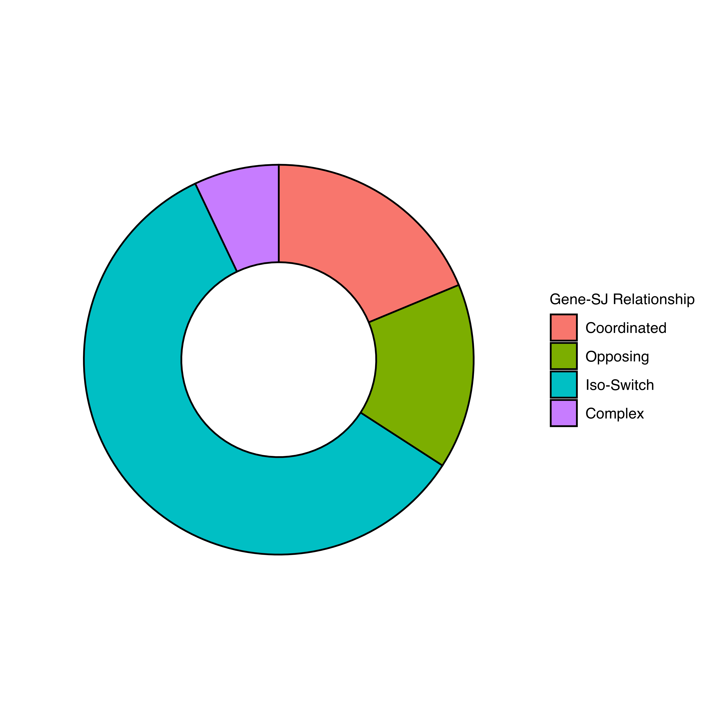
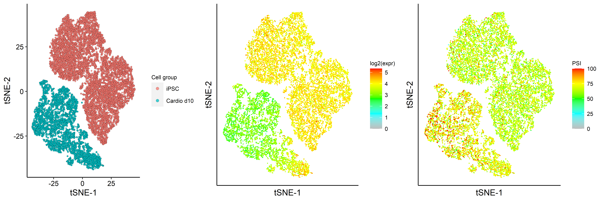

<!--
# droplet_call_SNV

10X 官方并没有为 droplet based 的数据设计 call SNPs 工具，但是官网 Q&A 提供了一个帖子，https://kb.10xgenomics.com/hc/en-us/articles/360016405671-Is-it-possible-to-call-SNPs-or-splicing-variants-from-single-cell-gene-expression-data-using-10x-software-,提供了三个 community-developed tool for calling SNPs or variants from single cell gene expression data, 分别为：      

https://github.com/10XGenomics/vartrix 
https://github.com/single-cell-genetics/cellSNP
https://github.com/wheaton5/souporcell


# 使用单细胞表达数据 call snp

## cellsnp-lite : call varients by using human droplet single cell data

软件使用参考：https://cellsnp-lite.readthedocs.io/en/latest/manual.html
参考common snp下载地址：https://sourceforge.net/projects/cellsnp/files/SNPlist/， 下载后需要手动给每个染色体加上"chr", 仅包含1-22号染色体和X染色体，没有其他染色体信息，因此也无法得到其他染色体的 snp 信息
http://ufpr.dl.sourceforge.net/project/cellsnp/SNPlist/genome1K.phase3.SNP_AF5e4.chr1toX.hg38.vcf.gz
软件安装地址：/home/zhangchunyuan/zhangchunyuan/tools/miniconda/bin/cellsnp-lite


cellsnp-lite 在有参考VCF文件时准确度更高，人类数据使用 1000g phased3 的数据作为参考，采用 model 1a 的方式call snp，      
其他物种没有参考 VCF 的时候只能使用 model 2a 的方式 call snp


## 其他参考
参考链接：
https://github.com/NCIP/Trinity_CTAT/wiki

CTAT Mutations Pipeline:
https://github.com/NCIP/ctat-mutations/wiki

https://github.com/NCIP/ctat-mutations
-->

# droplet-based 单细胞数据可变剪切分析

## 简介

本流程适用于 10X 单细胞数据和 M20 单细胞数据，可在**聚类簇间**、**细胞类型间**、**样本间**、**组间**进行比较检测可能有可变剪切的基因。本流程输入数据为常规分析产生的 bam 文件和 barcode 文件，需常规分析运行结束后进行。

## 创建文件夹

```
mkdir yourproject-SJ
cd yourproject-SJ

ln -s 10X_project/result .
```

或者

```
mkdir result
cd result
ln -s your_10X_project/result/cellranger .
ln -s your_10X_project/result/Clustering .
ln -s your_10X_project/result/Count_QC .
cd -
```


## 下载流程并配置环境

从 github 上下载流程，将文件夹 rules、scripts、envs，文件 Snakefile 软链到工作目录，拷贝配置文件目录 config 到工作目录

```
git clone http://gitlab.oebiotech.cn/chunyuan.zhang/scrna_alternative_splicing.git
```

加载环境

```
module purge
ln -s scrna_alternative_splicing/envs .
source envs/.bashrc
mlns
```

## 填写配置文件

### config/config.yaml 文件

```
# 项目相关参数
report:
  Project_Num: Alternative_Splicing-b1                           # 本分析项目号
  Raw_Task_Num: XXX-b1                                           # 原常规分析项目号
  Task_Num: XXX-b1                                               # 本分析任务号
  password: XXX                                                  # 服务器密码
  Customer: XXX
  Sales: XXX
  Executor: OEXXX
  Species: Human                                                 # eg: Human 或 Mouse
  Sample: 人-癌组织样本
  Sample_Num: 2
  Project_Type: '单细胞可变剪切分析'

# 文库
library:
  # 文库版本, V2 或者 V3, 与 whitelist 和 UMI 长度有关
  # 公司内部数据版本均为 V3，外来数据需要自行确认
  version_10X_chemistry: V3

# 分析相关参数
params:
  splicing:
    prepare:
      genename_or_geneid: "gene_name"       # 不要修改该参数 
      dimension_type: "umap"                # 降维类型有两种，umap 或者 tsne
      use_routine_genearray: TRUE           # 不要修改该参数 
    analysis:
      filter_hard: TRUE                     # 是否自动检测基因筛选标准，默认为否
      filter_gene_in_percent_cell: 0.01     # 基因至少在百分之多少的细胞中表达；filter_hard 设置为false时，本参数失效
      filter_sj_in_percent_cell: 0.01       # junction至少在百分之多少的细胞中表达；filter_hard 设置为false时，本参数失效
      iterations: 100                       # 重排次数
      min_gene_expression: 0.01             # 按照样本基因log2(表达量)均值筛选基因，设置为0表示平均表达量为1，设置一个极小值表示不进行筛选
    plot:
      pvalue_sj: 0.05
      delta_sj: 5                           # delta_sj 和 log2fc_sj 二选一
      # log2fc_sj: 1
      pvalue_gene: 0.05
      log2fc_gene: 1
      # qvalue_gene: 0.05
      ## scatter
      psi_or_expr: "psi"                    # psi 和 expr 二选一
      top_DE_junctions: 5
      ## structure_plot
      diff_exp_junction_only: TRUE
      rescale_introns: TRUE
      show_protein_coding_only: TRUE
    report: FALSE                           # TRUE 出具报告， FALSE 则不出

```

### config/samples.csv 文件

- 可使用 “#” 注释的方式删除样本

文件示例：
```
sampleid,species,group,batchid
SRR9008752,人-组织,S1,1
SRR9008753,人-组织,S1,2
SRR9008754,人-组织,S2,3
SRR9008755,人-组织,S2,4
```

### config/diff_group.csv 文件

样本之间比较关键词为 **sampleid**，组之间比较关键词为 **group**，聚类簇间比较关键词为 **clusters**，细胞类型间比较关键词为 **celltype**。

- 比较类型需和原报告中 meta.data 中存在
- 比较组数量可任意添加
- 可使用 “#” 注释的方式删除比较组

文件示例：
```
treatment,treatment_name,control,control_name,type
SRR9008752,SRR9008752,SRR9008755,SRR9008755,sampleid
S1,S1,S2,S2,group
1,1,2,2,clusters
```


## 流程提交

### 检查Snakefile配置是否正确

```
smt Snakefile 
```

### 提交任务

```
smq Snakefile 
```

# 2023-11-20 更新

部分项目的样本来自两个及以上常规单细胞分析，如 XXX-b1, XXX-b2 等，为了便于数据整合，原项目号不再在config/config.yaml文件中填写，config/config.yaml文件中的 Raw_Task_Num 选项已删除，改为在config/samples.csv中填写，新的文件示例如下：

### config/samples.csv 文件

- 可使用 “#” 注释的方式删除样本

文件示例：
```
sampleid,species,group,batchid
SRR9008752,人-组织,S1,1,XXX-b1
SRR9008753,人-组织,S1,2,XXX-b1
SRR9008754,人-组织,S2,3,XXX-b2
SRR9008755,人-组织,S2,4,XXX-b3
```


<!--

## 样本间比较示例


绘制差异剪切火山图


注意：差异可变剪切意味着差异表达，同时包含差异剪切的基因，即这些差异可变剪切基因是差异表达基因的子集。

## Gene-splicing dynamics

基因剪切的动态可以分为4种类型，分别为： coordinated, opposing, isoform-switching, and complex.

* `Coordinated` gene-splicing relationship refers to the change in mean gene expression is in the same direction with the corresponding splicing junction(s).
* `Opposing` gene-splicing relationship refers to the change in mean gene expression is in the opposite direction to the corresponding splicing junction(s).
* `Isoform-switching` refers to genes that are differentially spliced without being differentially expressed.
* `Complex` gene-splicing relationship refers to genes with both coordinated and opposing relationships with the corresponding splicing junctions.



## 将 Coordinated 的基因反映在tSNE上


左图为两个样本的降维结果，中图为基因"VIM"的表达情况，右图为可变剪切"chr10:17235390:17235845"的PSI情况


## 将 Opposing 的基因反映在tSNE上



左图为两个样本的降维结果，中图为基因"UQCRH"的表达情况，右图为可变剪切"chr1:46310317:46316551"的PSI情况

## 将 Isoform-switching 的基因反映在TSNE上


左图为基因 "RBM39" 的表达情况， 中图为可变剪切 "chr20:35740888:35741940" 的PSI情况，右图为可变剪切 "chr20:35739018:35740823" 的PSI情况

## 将 Complex 的基因反映在TSNE上


上三张图为基因 "TPM1"，下三张图为基因 "TPM2"
上中图为可变剪切 "chr15:63064143:63065895"，上右图为可变剪切 "chr15:63044153:63056984" 的 PSI 情况
下中图为可变剪切 "chr9:35684808:35685268"，下右图为可变剪切 "chr9:35684551:35685063" 的 PSI 情况


* For both TPM1 and TPM2 genes, their gene expressions (left) are up-regulated in day-10 cardiomyocytes relative to iPSCs.
* Similar to gene expression profile, one of the splice junctions (middle) for these genes are up-regulated in day-10 cardiomyocytes relative to iPSCs.
* On the other hand, the other splice junction (right) for these genes are down-regulated in day-10 cardiomyocytes relative to iPSCs.
* Note gene expression represented by log2(expression) scale whereas splicing rate represented by PSI scale.

